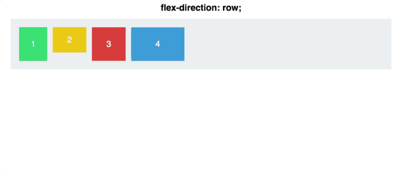

autoscale: true

# Ready for more?


---

# CSS Layout

The default arrangement for elements is one thing after another top to bottom, according to the html.

---

# Box Dimensions with Width and Height

By default a box will be just big enough to hold its contents.

You can set exact dimensions with the `width` and `height` properties.

```css
width: 100px;
width: 50%;
width: 30rem;
height: 200px;
height: 10rem;
```

Why would you not use a percentage measurement for height?

---

# Centering

To horizontally center a single block-level element relative to the horizontal size of the window or its parent element, you can let the browser figure it out:

```css
margin: 0 auto;
```

### For more complicated scenarios and considerations, see CSS-Tricks' excellent [Guide to Centering in CSS](https://css-tricks.com/centering-css-complete-guide/)

---

# The Display Property

This powerful property lets you change the behavior of the rectangular boxes (which is how we think about elements in a layout) on your page.

```css
display: inline;
display: block;
display: inline-block; /* inline flow but can have height and width */
display: none; /* hidden from view but still in the dom */
```

---

# `display: flex`

### aka

## Flexbox

#### aka

##### The Flexible Box Layout Module (no one calls it that)

---

# Flexbox

Flexbox is one of three major ways to lay out web pages, along with _floats_ and _grid_.

With flexbox, we fill one-dimensional containers with multiple blocks that grow and shrink to fit the current page size.

To use it, you need to use multiple properties in conjunction with each other. It's important to have a conceptual understanding of how it works.

---

```css
.container {
  display: flex;
}
```


---

# A Trick to Using Flexbox

Remember that **different properties apply** to:

- a _parent_ element (the **flex container**)
- _child_ elements (the **flex items**)

This is clearly illustrated in this guide:
[CSS-Tricks: Complete Guide to Flexbox](https://css-tricks.com/snippets/css/a-guide-to-flexbox/)

---

# Why is it called "flex"?

The idea of a flexible layout is that it gracefully expands, resizes, or wraps according to the available space. If there is no extra space available, the effects of flexbox won't be obvious or seem to apply.

- You may need to resize your browser window to see if your flexbox properties are having the intended effect.
- You may need to add a height to a flex container if your `flex-direction` is set to `column` so that you create extra space to distribute.

---

# `flex-direction`

The default flex-direction is `row`, which is horizontal.



---

### The main axis goes in the same direction as the flex-direction

### The cross axis is perpendicular to the flex-direction


---

# Values for `flex-direction`

Changing the value of `flex-direction` rotates the main axis.

Items will be laid out either in rows or columns, in order from left to right or right to left, depending on the direction of the main axis.

```css
flex-direction: row; /* default; horizontal in order left to right */
flex-direction: row-reverse; /* horizontal in order right to left */
flex-direction: column; /* vertical, in order top to bottom */
flex-direction: column-reverse; /* vertical, in order bottom to top */
```

---

# `flex-wrap`

Flexbox tries to fit all your flex items on one line by default, which may resize your flex items.

But if you want them to wrap to the next line to accommodate their size, you need to set the flex-wrap property on the flex container.

```css
flex-wrap: nowrap; /* default; items will squish on one line */
flex-wrap: wrap; /* nicely wrap them from line to line as needed */
```

[visual demo on CodePen](https://codepen.io/team/css-tricks/pen/1ea1ef35d942d0041b0467b4d39888d3)

---

# Aligning flex items

The `justify-content` and `align-items` properties are set on the flex container and depend on the direction of the main axis.

### `justify-content`
Arranges items along the main-axis, in the same direction as flex-direction

### `align-items`
Arranges items along the cross-axis, perpendicular to flex-direction

---

# `align-content`

## use with `flex-wrap`

Tells the flex container what to do about the extra space along the cross-axis, similar to how `justify-content` works on the main-axis.

It doesn't do anything if your content takes up all the width along the vertical axis. That is, it is helpful when you have content that wraps.

---

# The `flex` shorthand property

- `flex-grow` - how flex-items should take up any extra space. A value of 1 means distribute the available space equally among all items. A value of 0 (the default) means the items do not grow.
- `flex-shrink` (optional) - how small items should get when their container gets smaller
- `flex-basis` (optional) - this is value used as a reference point to calculate the sizes for grow or shrink.

You can just use the shorthand property `flex` and let the browser figure out what the other values should be.

```css
.flex-item {
  flex: 1;
}
```

[CSS-Tricks Flex shorthand property](https://css-tricks.com/almanac/properties/f/flex/)

---

# Floats

If you're using flexbox, you really should not have to use floats at all. It comes in handy sometimes, though, especially when you want to get text to wrap around images.

Setting the `float` property takes an element out of the normal flow and moves it to the left or right of its containing box. It will "float" into that position until it touches the edge of the box or bumps into another floated element.

```css
float: left;
float: right;
float: none;
```

[MDN float property](https://developer.mozilla.org/en-US/docs/Web/CSS/float)

